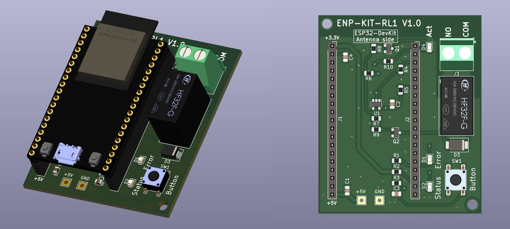

## ENP-KIT-RL1

The ENP-KIT-RL1 board is used for demonstrating the capabilities of the Enapter software, implements 1 channel normally open relay.

Board was designed in an open-source software, KiCad 6.0.

| Description        | Resource                                                     | Note        |
| ------------------ | ------------------------------------------------------------ | ----------- |
| BOM                | <a href="./Production_files/ENP-KIT-RL1_V1.0_ibom.html" target="_blank">FULL BOM</a> | HTML Table  |
| Production files   | [Full set of docs/files](./Production_files/ENP-KIT-RL1_V1.0.zip)| ZIP archive |
| Schematic          | [ENP-KIT-RL1](./Production_files/ENP-KIT-RL1_V1.0_schematic.pdf)  | PDF         |
| Quick Start Guide  | Coming soon... | PDF         |
| Plastic Enclosure  | <a href="https://www.budind.com/product/general-use-boxes/utilibox-style-j-series-utility-boxes/cu-1941-mb" target="_blank">CU-1941-MB</a> | Plastic Box |
| Where to order for production  | <a href="https://cart.jlcpcb.com/quote?orderType=1&stencilLayer=2&stencilWidth=100&stencilLength=100" target="_blank">jlcpcb.com</a> | You can order the board together with SMT Assembly, there are special BOM file (/BOM/*bom_for_JLCPCB) and CPL file (/Position/*cpl_for_JLCPCB) |

You also need module:
ESP32-DevKitC-32D and micro USB - USB cable.

Be careful these components are not in the BOM.
