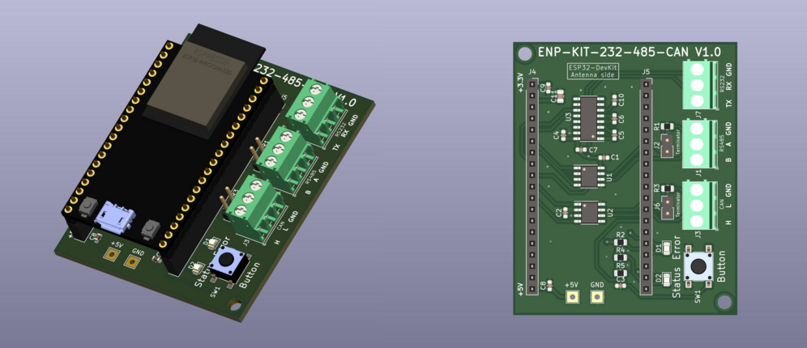

## ENP-KIT-232-485-CAN

The ENP-KIT-232-485-CAN board is used for demonstrating the capabilities of the Enapter software, implements RS232, RS485, CAN interfaces.

Board was designed in an open-source EDA software <a href="https://www.kicad.org/" target="_blank">KiCad 6.0.</a>

| Description        | Resource                                                     | Note        |
| ------------------ | ------------------------------------------------------------ | ----------- |
| Production files   | [Full set of docs/files](./Production_files/ENP-KIT-232-485-CAN_V1.0.zip)| ZIP archive |
| Schematic          | [ENP-KIT-232-485-CAN](./Production_files/ENP-KIT-232-485-CAN_V1.0_schematic.pdf)  | PDF         |
| Quick Start Guide  | Coming soon... | PDF         |
| Plastic Enclosure  | <a href="https://www.budind.com/product/general-use-boxes/utilibox-style-j-series-utility-boxes/cu-1941-mb" target="_blank">CU-1941-MB</a> | Plastic box, suitable for this board |
| Where to order for production  | <a href="https://cart.jlcpcb.com/quote?orderType=1&stencilLayer=2&stencilWidth=100&stencilLength=100" target="_blank">jlcpcb.com</a> | You can order the board together with SMT Assembly, there is a separate [archive](./Production_files/jlcpcb_files_V1.0.zip) that includes everything you need |

You also need module:
ESP32-DevKitC-32D and micro USB - USB cable.

Be careful these components are not in the BOM.
